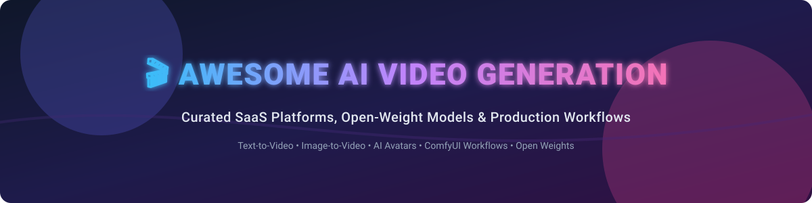

# 🎬 Awesome AI Video Generation

  

  
  
  
  
  

## 🚀 Top AI Video Generation Ecosystem & Directory

A comprehensive, curated directory of **SaaS platforms**, **open-source AI video models**, **text-to-video generators**, **image-to-video tools**, and **AI avatar video creators**. Designed for filmmakers, marketers, AI engineers, and content creators looking for generative video models and production workflows.

> **Last updated: September 2026** 📅

---

## 📌 Table of Contents

- [🏢 SaaS & Hosted Platforms](#-saas--hosted-platforms)
- [⚡ Open-Source GitHub Projects & Models](#-open-source-github-projects--models)
- [🤝 How to Contribute](#-how-to-contribute)
- [💖 Support & Sponsorship](#-support--sponsorship)
- [⚠️ Disclaimer](#%EF%B8%8F-disclaimer)
- [📈 Star History](#-star-history)

---

## 🏢 SaaS & Hosted Platforms

> 📊 **Market Insights**: The global AI video generation market size is estimated at **$2.5 Billion+ in 2026** and projected to surpass **$15 Billion by 2032**. The sector is currently **moderately fragmented**: consumer text-to-video and avatars have distinct leaders (Runway, Kling, Synthesia, HeyGen), but rapid open-weight model advancements prevent a single "winner-take-all" monopoly.

The table below lists top commercial AI video platforms sorted by **Estimated Company Size / Valuation** (descending):

| Platform | Description | Estimated Size / Valuation | Starting Price | Free Tier / Trial Limit |
| :--- | :--- | :--- | :--- | :--- |
| **[Kling AI](https://klingai.com/)** 🇨🇳 | High-performance generative text-to-video platform by Kuaishou with hyper-realistic motion. | **~$15 Billion+ Valuation** ($500M ARR) | $8.80/month (Standard plan) | 66 free credits daily (resets every 24h, non-cumulative) |
| **[Runway](https://runwayml.com/)** 🇺🇸 | Industry-leading generative video platform (Gen-3/Gen-4) for filmmakers & creative teams. | **~$5.3 Billion Valuation** ($200M+ ARR) | $12/month (Standard plan, annual) | One-time 125 credits on sign-up (watermarked, non-renewing) |
| **[Synthesia](https://www.synthesia.io/)** 🇬🇧 | Market leader in AI avatar & talking-head video generation for corporate training & localization. | **~$4.0 Billion Valuation** ($150M ARR) | $18/month (Starter plan, annual) | Up to 10 minutes of video per month (watermarked, no MP4 download) |
| **[Luma Dream Machine](https://lumalabs.ai/)** 🇺🇸 | High-fidelity text-to-video and image-to-video generative AI model platform. | **~$4.0 Billion Valuation** ($80M ARR) | $30/month (Plus plan) | ~80 credits per day (~1 video generation per day, watermarked) |
| **[MiniMax / Hailuo AI](https://hailuoai.video/)** 🇨🇳 | High-motion generative video platform producing cinematic realism and dynamic motion. | **~$4.0 Billion Valuation** (Public / HKEX) | $9.99/month (Standard plan) | 200 initial trial credits on sign-up (watermarked) |
| **[HeyGen](https://www.heygen.com/)** 🇺🇸 | Script-to-video synthetic presenter platform with instant video translation & custom avatars. | **~$500 Million Valuation** ($200M ARR) | $24/month (Creator plan, annual) | 1–3 free videos per month (up to 1 min each, watermarked) |
| **[Pika](https://pika.art/)** 🇺🇸 | Consumer & prosumer generative video platform focused on short text-to-video clips & animation. | **~$470 Million Valuation** ($85M ARR) | $8/month (Standard plan, annual) | 80 credits per month (480p resolution, watermarked) |
| **[PixVerse](https://pixverse.ai/)** 🇨🇳 | Generative AI video creation platform for short viral clips and expressive motion models. | **~$100 Million+ Valuation** | $10/month (Standard plan) | 60 free credits daily + initial 90 signup credits (watermarked) |
| **[Elai.io](https://elai.io/)** 🇺🇸 | AI avatar text-to-video platform for automated training video creation at scale. | **~$30 Million Valuation** | $23/month (Creator plan, annual) | 1 minute of total video render time on signup |
| **[Colossyan](https://www.colossyan.com/)** 🇬🇧 | AI video presenter platform built specifically for workplace learning & corporate HR teams. | **~$25 Million Valuation** | $19/month (Starter plan, annual) | 20 minutes of video generation per month |

---

## ⚡ Open-Source GitHub Projects & Models

Open-weight video generation models have advanced dramatically. Self-hosting via node-based orchestration tools like **ComfyUI** allows creators to run state-of-the-art text-to-video and image-to-video models locally.

Repositories are sorted below by **GitHub Stars_Count** (descending):

- **[ComfyUI](https://github.com/comfyanonymous/ComfyUI)**   
  🎨 Node-based graphical interface and backend orchestration layer for running Wan, HunyuanVideo, LTX, CogVideoX, and Stable Video Diffusion workflows locally.

- **[Open-Sora](https://github.com/hpcaitech/Open-Sora)**   
  🚀 Fully open-source initiative providing transparent training pipelines and model weights aimed at democratizing Sora-level video generation.

- **[Wan (Wan2.1 / Wan-Video)](https://github.com/Wan-Video)**   
  🌟 State-of-the-art open-weight video generative model series (Apache 2.0). Exceptionally strong text-to-video & image-to-video fidelity and motion control.

- **[CogVideo / CogVideoX](https://github.com/THUDM/CogVideo)**   
  🧠 Open text-to-video and image-to-video model series developed by THUDM featuring permissive licensing and strong research support.

- **[Stable Video Diffusion (generative-models)](https://github.com/Stability-AI/generative-models)**   
  🔬 Stability AI's foundational open image-to-video latent diffusion models and motion architecture.

- **[HunyuanVideo](https://github.com/Tencent-Hunyuan/HunyuanVideo)**   
  🐉 Tencent’s open systematic framework for large video generation, known for high motion physics and quality in the open-weight community.

- **[AnimateDiff](https://github.com/guoyww/AnimateDiff)**   
  🎞️ Plug-and-play motion module for animating personalized Stable Diffusion text-to-image models without retraining.

- **[LTX-Video](https://github.com/Lightricks/LTX-Video)**   
  ⚡ Real-time open video generation model by Lightricks optimized for fast inference speed and lower VRAM usage.

- **[Mochi 1](https://github.com/genmoai/models)**   
  🍬 Open video generation model architecture by Genmo focused on high-fidelity motion and prompt adherence.

- **[Awesome Video Diffusion Models](https://github.com/showlab/Awesome-Video-Diffusion)**   
  📚 Curated research catalog tracking video diffusion papers, benchmarks, and model developments.

---

## 🛠️ Additional Open-Source Options & Production Stacks

- **Quality Leaders (Open Weights)**: Wan 2.1 and HunyuanVideo for general high-fidelity text-to-video.
- **Research & Full Pipelines**: Open-Sora for end-to-end transparent training data pipelines.
- **Low VRAM & Speed**: LTX-Video for fast real-time previewing on consumer GPUs.
- **Node Workflows**: ComfyUI + open video model + Frame Interpolation (RIFE) + Upscalers (RealESRGAN).

---

## 🤝 How to Contribute

Contributions are welcome! Please follow these simple guidelines:

1. 🍴 Fork the repository.
2. 📝 Add or edit entries in `README.md` (maintain standard table/list formatting).
3. ℹ️ Ensure entries include name, official URL, concise description, pricing/Stars_Badges, and factual category.
4. 📥 Submit a Pull Request (PR) with a brief summary of additions.

Refer to the curated collection at [Awesome-Awesome-Awesome](https://github.com/ishandutta2007/Awesome-Awesome-Awesome) for more curated lists.

---

## 💖 Support & Sponsorship

If you find this repository helpful for your projects, research, or video production workflows, please consider supporting the project!

- ⭐ **Star** this repository to increase visibility.
- 🔀 **Fork** and contribute new tools or updates.
- 📢 **Share** with colleagues and AI developer communities.
- ☕ **Buy me a coffee**: Support ongoing curation and maintenance via the [GitHub Sponsor Dashboard](https://github.com/sponsors/ishandutta2007).

Thank you for being part of the open AI video generation ecosystem! 🙌

---

## ⚠️ Disclaimer

- This is a **community-curated list** — provided for informational purposes without commercial endorsement.
- Generative video models can synthesize media; users must adhere to ethical guidelines, copyright laws, likeness rights, and content provenance (e.g. C2PA standards).
- Open-weight models require dedicated GPU hardware. Check specific licenses (Apache 2.0, MIT, or custom non-commercial licenses) prior to commercial deployment.

---

## 📈 Star History

